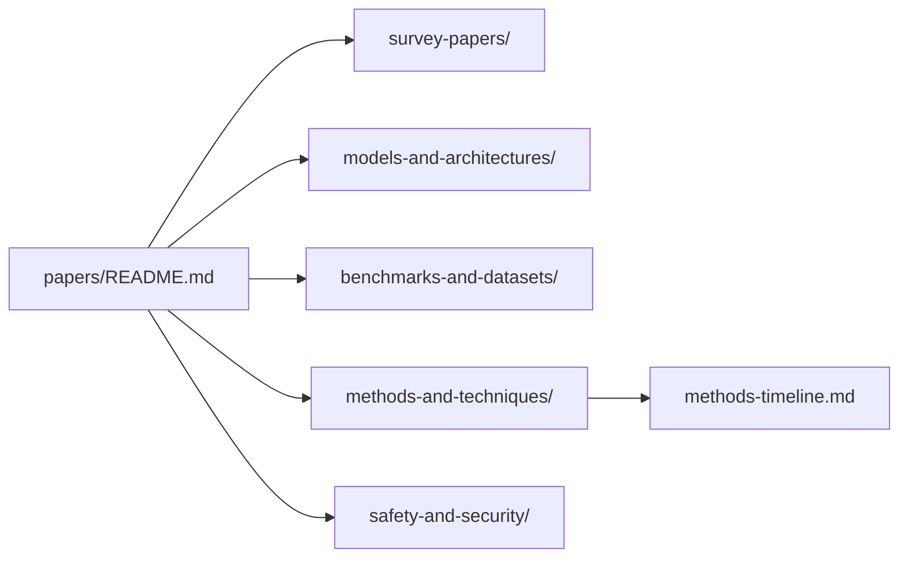

# Per-Paper Report Portal

The comprehensive paper-level reports now live in [papers/README.md](./papers/README.md).
A generated methods chronology now lives in [methods-timeline.md](./methods-timeline.md).

The rendered preview stays on this portal page so readers can orient themselves across the full method landscape before dropping into individual paper dossiers.

## What Is New

- One dedicated markdown report per entry in `papers/*/README.md`.
- The index now shows a `Report Included` checkbox for every source entry, so future papers without reports stay visible but unmarked.
- Every report now includes a `Quick Read`, two Mermaid figures, and paper-level sections for `code and supporting artifacts`, `novelty`, `core contributions`, `framework and operating logic`, `evidence`, `gaps and limitations`, `how to improve`, and `connections`.
- Confirmed link mismatches are called out inside the affected entry reports as well as in [maintenance-findings.md](./maintenance-findings.md).
- The methods timeline organizes the method wave by grounding, RL/post-training, data synthesis, memory/planning, and multi-agent orchestration.

## Counts

| Section | Count |
| --- | --- |
| Survey Papers | 8 |
| Models and Architectures | 22 |
| Benchmarks and Datasets | 28 |
| Methods and Techniques | 16 |
| Safety and Security | 15 |
